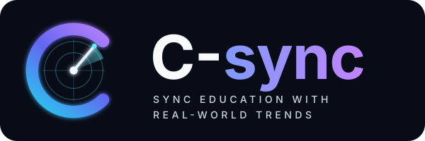
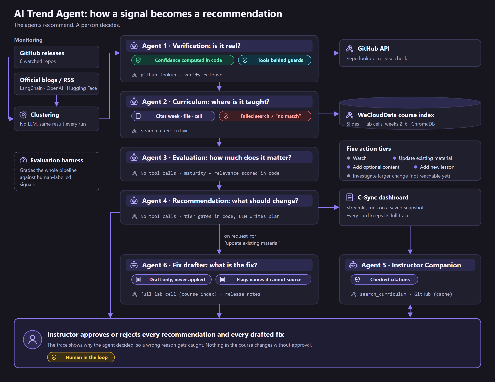

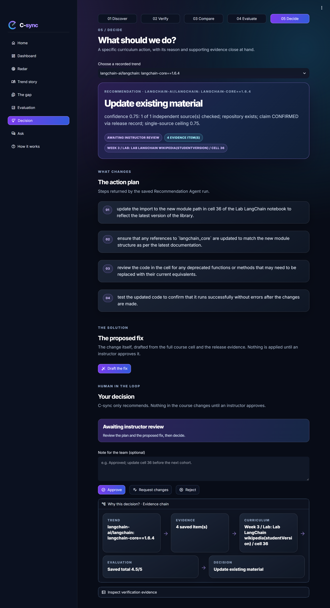

<p align="center">
  
</p>

# C-sync: AI Trend Agent

**Keep a course in step with the AI field.** C-sync watches GitHub releases and
official AI blogs, checks which trends are real, finds where the course already
teaches them, and recommends what to change, down to the slide or lab cell. **The
agents only recommend; an instructor approves.**

Capstone project for the **SDA × WeCloudData Agentic AI Engineering Program**.

🧭 [Architecture diagram](03_assets/diagrams/architecture.svg) ·
🖼️ [Screenshots](03_assets/screenshots/)

## Team

| Name | Role |
| --- | --- |
| Abdurahman Al-Duraywish | Team lead · integration: end-to-end pipeline, C-sync interface, Docker |
| Rafif Alsuhaibani | Verification agent and its tests · gold-dataset evaluation |
| Aldanah Aldosari | Evaluation agent · SkillRadar UI, the base of C-sync |
| Ruyuf Almajnooni | Data ingestion · curriculum retrieval (hybrid RAG search) and the curriculum agent |

## The problem

AI tooling changes weekly; course material does not. In one four-week capture
(21 Sep 2026), the watched sources produced **74 signals**. Those are **57
distinct trends**; the 30 largest were assessed, giving **29 recommendations**, of
which **13 need action** (6 update existing material, 7 add optional content).
Finding those 13 by hand, and knowing which slide or lab cell each one affects,
is the work C-sync automates.

## How it works

<p align="center">
  
</p>

| Stage | What happens | Tools |
| --- | --- | --- |
| Monitoring | GitHub releases from 6 repos (langchain, openai-python, chroma, fastapi, langgraph, langsmith-sdk) and 3 official blogs (LangChain, OpenAI, Hugging Face); Hacker News is an opt-in secondary source | GitHub API, RSS |
| Clustering | Groups signals about the same event: rare identifiers first, then title similarity. No LLM, same result every run | none |
| Agent 1: Verification | *Is it real?* Checks the repository and the exact release | `github_lookup`, `verify_release` |
| Agent 2: Curriculum | *Where is it taught?* Searches the course index (slides and lab cells, weeks 2–6) and cites week, file and cell | `search_curriculum` (ChromaDB) |
| Agent 3: Evaluation | *How much does it matter?* Maturity and relevance | none |
| Agent 4: Recommendation | *What should change?* One of five action tiers, plus a plan | none |
| Agent 5: Instructor Companion | Answers an instructor's questions about one recommendation, with citations | `search_curriculum`, GitHub (cache only) |
| Agent 6: Fix drafter | *What is the fix?* On request, drafts the changed lab cell for an "update existing material" recommendation, from the full cell and the release notes. A draft only, never applied | course index (full cell), release evidence |

The five action tiers are `watch`, `update_existing_material`,
`add_optional_content`, `add_new_lesson` and `investigate_larger_change`.

### Guardrails

- **Confidence is computed in code.** The model chooses which tools to call and
  writes the explanations; Python computes every score from what the tools
  actually confirmed. Maturity, relevance and the tier gates are also code.
- **Tools behind guards.** A lookup that returns the wrong repository is
  rejected; a failed lookup counts as "unchecked", never as "does not exist".
- **A failed search is not "no match".** The curriculum agent keeps three
  outcomes apart: searched, tried but failed, and skipped. This fixed a real bug
  where an API outage produced confident "add a new lesson" advice.
- **Checked citations.** The Companion's answers must cite the record, and
  invented or misplaced citations are flagged.
- **Human in the loop.** Every recommendation waits for an instructor to
  approve, request changes or reject it, and a drafted fix is never applied
  automatically.

## Quick start

### With Docker (recommended)

With [Docker](https://docs.docker.com/get-docker/) installed:

```bash
docker compose up --build
```

Open http://localhost:8501. No API key is needed: C-sync shows the recorded run.

- **Optional keys:** for the Ask page and "Draft the fix", copy `.env.example`
  to `.env` and set `OPENAI_API_KEY` before starting. The container reads it at
  start-up; it is never copied into the image.
- **Course index:** those two pages also search the course index, so build
  `vectorstore/` first (see [Course material](#course-material)). It is mounted
  into the container, not baked in.
- **Saved decisions:** instructor decisions are kept in the `reviews` volume and
  survive restarts. `docker compose down` stops C-sync and keeps them;
  `docker compose down -v` deletes them.
- **On Windows:** Docker Desktop needs WSL 2 (`wsl --install`). Without it,
  Docker reports "virtualization support not detected".

### Without Docker

Python 3.10 or newer:

```powershell
python -m venv .venv
.venv\Scripts\Activate.ps1          # macOS/Linux: source .venv/bin/activate
pip install -r requirements.txt
Copy-Item .env.example .env         # macOS/Linux: cp .env.example .env
python -m streamlit run c_sync/app.py
```

`OPENAI_API_KEY` is needed only for live agent runs, and `GITHUB_TOKEN` raises
the GitHub rate limit. Never commit `.env`.

## C-sync, the interface

The left sidebar holds every page. The top bar holds the five pipeline stages
(01 Discover, 02 Verify, 03 Compare, 04 Evaluate, 05 Decide).

| Page | What it shows |
| --- | --- |
| Home | "From noise to curriculum": signals → clusters → assessed → recommendations → actionable, as squares sized by count |
| Dashboard | Every recommendation, most urgent first, with its review status and filters |
| Radar | Each assessed trend as a light on a sweeping radar |
| Trend story | The original signal and the verification evidence: repository stars and the release check |
| The gap | The trend beside the course slide or lab cell it affects |
| Evaluation | Maturity, relevance and overall score, revealed on request |
| Decision | The recommended action and plan; **the proposed fix** (before/after of the lab cell, drafted on request, never applied); and **your decision**: Approve, Request changes or Reject, with a note |
| Ask | The Instructor Companion: questions about one recommendation, answered with citations |
| How it works | The five steps in plain language |

Every number comes from the recorded run in `01_data/demo_snapshot.json`; no
agent is re-run to show a page. Only Ask and "Draft the fix" call a model, and
only when `OPENAI_API_KEY` is set. See [c_sync/README_UI.md](c_sync/README_UI.md).

<p align="center">
  
  
</p>

## Running the pipeline

The demo uses a frozen run because live runs are measurably non-deterministic
(the same 10 signals changed tier on 5 of 10 across three live runs).

```powershell
python 02_src/demo_snapshot.py --replay                                              # replay the recorded run, 0 API calls
python 02_src/monitoring_github.py --days 30                                          # fetch GitHub releases
python 02_src/monitoring_rss.py --days 30 [--secondary]                               # fetch blog posts (+ Hacker News)
python 02_src/clustering.py --signals 01_data/signals.json                            # cluster signals
python 02_src/agents/verification.py --signals 01_data/signals.json --show-reasoning   # verify (no key: scripted tool loop, same scorer)
python 02_src/demo_snapshot.py --capture --snapshot 01_data/experiment.json --limit 2 # a new live capture (needs OPENAI_API_KEY)
```

Set `SNAPSHOT_PATH=01_data/experiment.json` to show a new capture in C-sync. On
Windows, set `PYTHONIOENCODING=utf-8` before the RSS fetcher, or non-ASCII titles
crash the console output.

### Course material

The course slides and labs are **not in this repository**: they are large and
not ours to redistribute. In this public copy, the course excerpts in the demo
snapshot are also replaced with a placeholder; citations (week, file, cell) remain. Place the PDF, PPTX and notebook files in
`01_data/curriculum/week_02/` … `week_06/`, then build the local index:

```powershell
python 02_src/curriculum_ingest.py --curriculum 01_data/curriculum --db ./vectorstore
python 02_src/curriculum_ingest.py --db ./vectorstore --query "chunking" --week 2
```

Without these files, C-Sync still runs from the demo snapshot. Only the Ask
page's course search and "Draft the fix" need the local index.

## Testing and evaluation

```powershell
python 02_src/agents/test_chain.py          # 243 checks, 0 API calls
python 02_src/tests/test_verification.py    # 14 verifier checks, 0 API calls
python 04_eval/run_eval.py --repeats 3 --out 04_eval/results/<name>.json
python 04_eval/compare.py <baseline.json> <after.json>
```

- **Offline suites:** 257 checks, all passing, with zero API calls. They cover
  every agent's deterministic logic, the three curriculum outcomes, the
  Companion's citation checks, the fix drafter and review panel, and a smoke run
  of every C-sync page. Both also run inside the Docker image:
  `docker compose run --rm -w /app c-sync python 02_src/agents/test_chain.py`.
- **Golden dataset:** `run_eval.py` scores the pipeline against human-labelled
  signals, including fabricated claims (`04_eval/data/test_signals_graded.json`,
  12 signals). Current results:

| Run | Clustering | Verification | Composite |
| --- | --- | --- | --- |
| Offline, scripted tool loop (`rescored_3_restored_fixed_nokey.json`) | 100 | 56.0 | 75.6 |
| Live, gpt-4o-mini, 3 repeats (`live_baseline_fixed_harness.json`) | 100 | 60.9 ± 3.4 | 78.3 ± 1.9 |

The composite covers only the layers that have gold labels. Curriculum,
evaluation and recommendation score `null` until the dataset carries expected
citations and tiers, and a missing label is never counted as zero. See
[04_eval/README.md](04_eval/README.md) and
[04_eval/DATASET_REQUIREMENTS.md](04_eval/DATASET_REQUIREMENTS.md).

## Known limitations

- **The gold dataset is small and one-sided.** It has 12 signals with no
  `update_existing_material` or `add_new_lesson` label. Every candidate positive
  case found by hand failed human review.
- **Three layers are unscored.** The curriculum, evaluation and recommendation
  metrics need event-level gold labels, and two of them need new agent outputs
  first (a stale flag and top-3 candidates).
- **`investigate_larger_change` is unreachable by design.** An evaluation
  carries a single curriculum match, so no multi-module change can be expressed yet.
- **Limited live testing.** The fix drafter has not had a live run (API spend
  limit), and the Companion has only been lightly tested live. Neither has an
  evaluation of answer quality yet.
- **Planned, not built:** a content-type agent (release, case study,
  self-promotion, opinion) to filter vendor case studies and Show HN posts before
  they reach the tier gates.

## Project structure

```text
01_data/
   curriculum/week_NN/      Course material (not in Git; see Course material)
   signals*.json            Saved monitoring signals
   demo_snapshot.json       The recorded run C-sync shows
02_src/
   agents/                  The five agents, their tools (tools.py) and test_chain.py
   tests/                   test_verification.py
   schemas.py               Shared data contracts between the stages
   monitoring_github.py     Fetch GitHub releases
   monitoring_rss.py        Fetch official blog posts
   clustering.py            Group signals into trends
   curriculum_ingest.py     Index PDF, PPTX and notebook content into ChromaDB
   demo_snapshot.py         Capture or replay a recorded run
03_assets/
   diagrams/                Architecture diagram (SVG + PNG)
   screenshots/             Screenshots of the C-sync pages
   logo/                    C-sync logo
04_eval/
   data/                    Gold-labelled datasets
   results/                 Saved evaluation runs
   run_eval.py, compare.py  Score a run against the gold labels; compare two runs
c_sync/                     C-sync, the interface (Streamlit)
Dockerfile, docker-compose.yml
```

Beyond the five standard items (`01_data/`, `02_src/`, `03_assets/`,
`requirements.txt`, `README.md`), `04_eval/` holds the evaluation harness,
`c_sync/` the interface, and the Docker files run it in a container.

Generated and private files (`vectorstore/`, `.env`, caches, course material,
saved decisions) are excluded by `.gitignore`, and from the Docker image by
`.dockerignore`.
